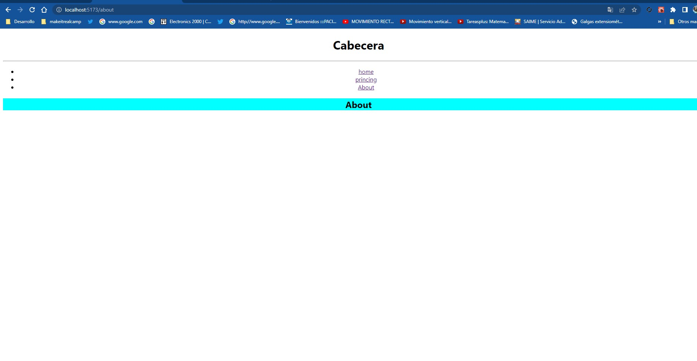

# Make It Real - Me gustan tus pestanas - React Router


se crea un proyecto donde se crean tres pestañas  donde se da click en cada pestaña y lo lega a otra rl. con ayuda de React Router 


## Table of contents

- [Overview](#overview)
  - [The challenge](#the-challenge)
  - [Screenshot](#screenshot)
- [My process](#my-process)
  - [Built with](#built-with)
  - [What I learned](#what-i-learned)
  - [Continued development](#continued-development)
  - [Useful resources](#useful-resources)
- [Author](#author)
- [Acknowledgments](#acknowledgments)


## Overview :
el proyecto tiene como objetivo crear 3 pestañas donde podamos ingresar sin estar recargando la pagina 
-

### The challenge
-el reto crear los componentes manejar el react router





## My process

-en este proyecto creamos un componente reutilizable para futuros proyectos 

### Built with

-React-Router
-javascript
-DOM
-REACT
-props-types
-json()

### What I learned


en este proyecto pudimos trabajar on varios componentes con ayuda de router podemos tener varias pestañas sin recargar la pagina 

we leave part of the api example:

```js
export const Routerprincipal = () => {
  return (
   <>
    <h1>Cabecera</h1>
        <hr />
        <nav>
          <ul>
            <li >
              <NavLink  
              to="/home" 
              claseName= {({isActive})=> isActive ?"activate" : ""}
              >home</NavLink>
            </li>
            <li>
            <NavLink claseName="activate" to="/princing">princing</NavLink>
            </li>
            <li>
            <NavLink claseName="activate" to="/about">About</NavLink>
            </li>
          </ul>
          </nav>  

   <section className='Contenido_Principal'> 
  
         <Routes>
             <Route path='/' element={<Home/>} />
             <Route path='/home' element={<Home/>} />
             <Route path='/princing' element={<Princing/>} />
             <Route path='/about' element={<About/>} />
             <Route path='*' element={<Error/>} />
           </Routes>
        
              
        </section>  
   
   </>
  )
}


```

### Continued development
- I will continue practicing to have a better handling of DOM, studying and consulting my mentors so that every day I improve my knowledge. about react how to handle events and improve the code as the best practice way.

 ### Useful resources
- https://classroom.makeitreal.camp/courses/82/topics/353/progress -- This helped me I will use it in the future.
-https://www.npmjs.com/package/prop-types

## Author


- Guillemro Alexander Herrera
-[github/guialexander@gmail.com]

## Acknowledgments

-I want to thank the make it real family since it has given me a new vision of my working life to improve and get out of the comfort zone and know that we can give more than what we already know
